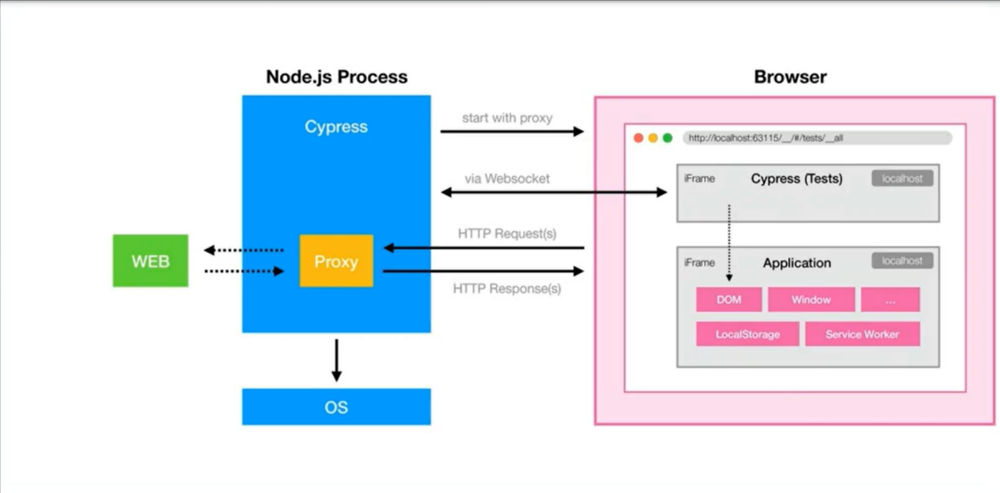

=== Course ===
- [Cypress UI automation testing for absolute beginners](https://www.coursera.org/projects/cypress-ui-automation-testing-for-absolute-beginners) from Coursera Project Network (instructor: Saurabh Dhingra)

=== Repository ===
- Learn Cypress by automating the web app from [node-express-sequelize-nextjs-realworld-example-app](https://github.com/cirosantilli/node-express-sequelize-nextjs-realworld-example-app)
  - `git clone git@github.com:cirosantilli/node-express-sequelize-nextjs-realworld-example-app.git`
  - `npm install --legacy-peer-deps`

=== Learning Objectives ===
- Understanding Cypress and its features
- Cypress architecture and environment setup
- Locating strategies
- Interacting with form elements
- Adding assertions to the test case
- Configuration file in cypress
- Hooks in Cypress
- Taking screenshot and videos of test run


=== Notes ===
- Cypress is a complete end-to-end test automation tool built to test modern-day web applications. 
- Capable of automating both UI and API
- Getting started:
	- Initialize npm project (for 'sample-ui-project' (new), and not 'node-express-sequelize...' (clone))
		- `npm init`
		- package.json is created, and contains project's details and dependencies
	- Install cypress
		- `npm install cypress --save-dev`
		- Installed under node_modules, and added as a dev dependency in package.json 
	- Open Cypress
		- Option 1: Open mode (GUI)
			- `npx cypress open`
			- If you timeout while opening on a slow machine
				- Go to node_modules/cypress/lib/tasks/verify.js, and increase VERIFY_TEST_RUNNER_TIMEOUT_MS (add another zero)
			- Click a test to run:
				- Command Log (left panel) - Cypress tests, shows the steps
					- Time travel: Snapshots taken.  See exactly what happened at each step, including network calls
				- App preview (right panel) - Application execution
				- Test code and application runs in same browser tab and JavaScript loop
		- Option 2: Run mode (CLI)
			- `npx cypress run --spec cypress/e2e/conduit/login.cy.js`
	- Specs are test files
		- Located in cypress/e2e folder with suffix of cy.ts or cy.js
	- In this example, start your web application with
		- `npm start`, and go to http://localhost:3000/
- Features:
	- Easy to setup and write a passing test
	- Complete framework, no need for 3rd party tools
	- Runs as fast as browser can render content
	- Debug with readable error messages
	- Automatic reloads when tests are updated
	- Automatic waits for commands and assertions before moving on
	- Intercept network call, and use spies, stubs, or clocks to mock response (ie. 500 or 401)
- Architecture
	- Node.js server (Test Runner) + browser
	- Test code communicates with Node.js via Websocket
	- Node.js process acts as a proxy for every http request, and can even run shell commands
	- Key to control the network is the proxy
		- http requests are intercepted, so Cypress can wait for a specific request to be fulfilled
	- http response can be completely overwridden and faked
- Writing tests
	- Enable syntax highlighting and intellisense
		- `/// <reference types="cypress"/>`
	- Uses Mocha testing framework, which supports
		- Chai assertions
		- Hooks
	- `describe()` creates test suite (can have multiple in a file)
	- `it()` creates test case
	- `.should()` for assertions
		- See [Assertions Reference](https://docs.cypress.io/guides/references/assertions)
		```
		describe("Login page test cases", () => {
			it("Login to application with correct credentials", () => {
				// Navigate to URL, and click on 'Sign in' link
				cy.visit("http://localhost:3000");
				cy.contains("a", "Sign in").click();

				// Get web element by CSS Selector, type email/password, click button
				cy.get("input[type='email']").type("alice@fake.com");
				cy.get("input[type='password']").type("admin");
				cy.get("button[type='submit']").click();

				// Assertion: Confirm text 'alice' is present (logged in)
				cy.get("a.nav-link[href^='/profile']").should("have.text", "alice");
			})
		})
		```
	- Configuration file: `cypress.config.ts` or (.js)
		- See [Configuration Reference](https://docs.cypress.io/guides/references/configuration)
		- `baseUrl: "http://localhost:3000"`, tests can refer to base url with slash `cy.visit("/");`
		- `retries: { "runMode": 0, "openMode": 1 }`, # times to retry entire test case upon failure.  openMode is for cypress open (GUI), runMode is for cypress run (CLI)
		- `video: true`, records videos, but only in runMode
	- Hooks
		- Execute code before/after certain events in a block (ie. root or suite level)
			- `before()` - first method in the block
			- `after()` - last method in the block
			- `beforeEach()` - before each test in the block
			- `afterEach()` - after each test in the block
	- Screenshots
		- Uses default filename 
			- `cy.screenshot();`
		- Blacks out element(s)
			- `cy.screenshot({blackout: ['input[placeholder="What\'s this article about?"]']});`
		- In run mode (not open mode), screenshots are automatically taken on failure